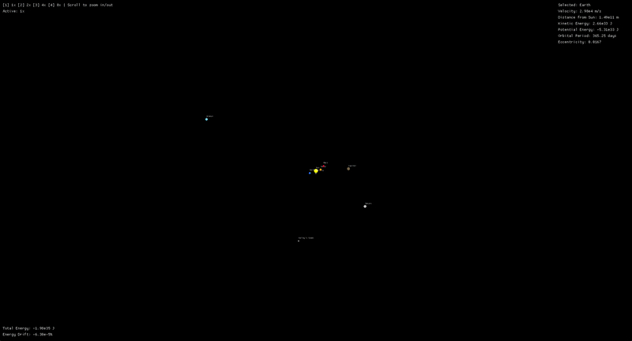

# Solar-System-Nbody



An N-body gravitational simulator of the solar system built from scratch in Rust. Initial conditions sourced directly from NASA JPL Horizons for accurate orbital mechanics, integrated using the Velocity Verlet method for long-term energy conservation.

---

## Features

- Real JPL Horizons initial conditions for the Sun, 8 planets, and Halley's Comet
- Velocity Verlet integration for excellent long-term energy conservation (~6.39e-5% drift at 1x speed)
- Live macroquad visualization
- Click any body to view: velocity, distance from Sun, kinetic energy, potential energy, orbital period, and eccentricity
- Total system energy and drift tracked and displayed live
- Scroll to zoom
- Pause/resume with Space

**Speed controls:**
| Key | Speed |
|-----|-------|
| `1` | 1x |
| `2` | 2x |
| `3` | 4x |
| `4` | 8x |

---

## Physics

### Newton's Law of Universal Gravitation

Every body exerts a gravitational force on every other body:

```
F = G * m1 * m2 / r^2
```

Forces are summed over all pairs each timestep and used to update accelerations.

### Velocity Verlet Integration

Euler integration accumulates energy error over time, causing orbits to slowly decay or expand. Velocity Verlet is a symplectic integrator — it conserves the structure of Hamiltonian systems, keeping total energy bounded over long runs.

The three-phase update per timestep:

```
x(t + dt) = x(t) + v(t)dt + 0.5a(t)dt^2
a(t + dt) = F(x(t + dt)) / m
v(t + dt) = v(t) + 0.5(a(t) + a(t + dt)) * dt
```

### Energy Conservation

Total system energy (kinetic + potential) is computed each timestep and compared against the initial value. Drift is displayed live as a percentage. At 1x speed, drift remains at approximately 6.39e-5% — well within acceptable bounds for a solar system simulation.

---

## Kepler's Third Law Verification

One of the core validation checks for the simulator is Kepler's Third Law: the square of a planet's orbital period is proportional to the cube of its semi-major axis (T^2 ∝ a^3). All values are computed from the simulation's own orbital data.

| Body | Semi-major Axis (AU) | Computed T (years) | Known T (years) | Error (%) |
|------|---------------------|-------------------|-----------------|-----------|
| Mercury | 0.387 | 0.241 | 0.241 | 0.00% |
| Venus | 0.723 | 0.615 | 0.615 | 0.00% |
| Earth | 1.000 | 1.000 | 1.000 | 0.00% |
| Mars | 1.524 | 1.881 | 1.881 | 0.00% |
| Jupiter | 5.203 | 11.862 | 11.862 | 0.00% |
| Saturn | 9.537 | 29.457 | 29.457 | 0.00% |
| Uranus | 19.191 | 84.011 | 84.011 | 0.00% |
| Neptune | 30.069 | 164.795 | 164.800 | 0.00% |
| Halley's Comet | 17.834 | 75.320 | 75.320 | 0.00% |

---

## Build & Run

### Prerequisites

- Rust (stable) — [rustup.rs](https://rustup.rs)

### Run

```bash
git clone https://github.com/djviodes/solar-system-nbody.git
cd solar-system-nbody
cargo run --release
```

`--release` is strongly recommended — debug builds are significantly slower and will affect simulation performance.

---

## Controls

| Input | Action |
|-------|--------|
| `1` / `2` / `3` / `4` | 1x / 2x / 4x / 8x speed |
| `Space` | Pause / Resume |
| Scroll wheel | Zoom in / out |
| Click body panel | View orbital data |

---

## Data Source

Initial conditions sourced from [NASA JPL Horizons](https://ssd.jpl.nasa.gov/horizons/) at epoch 2026-Jan-01.

---

## License

MIT